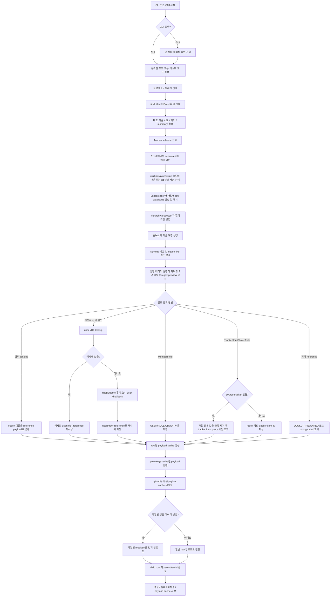

# 아키텍처

## 개요

이 프로젝트는 Excel 기반 계층형 데이터를 Codebeamer Tracker Item payload로 변환하고 업로드하는 자동화 파이프라인입니다.

코드베이스는 크게 여섯 계층으로 나뉩니다.

1. 엔트리 포인트
2. 입력 reader
3. hierarchy processor
4. schema 및 매핑
5. payload 모델과 오케스트레이션
6. Codebeamer API 접근

## 주요 모듈

### 엔트리 포인트

- `gui_main.py`: 현재 기본 PySide6 GUI 엔트리 포인트
- `cli_main.py`: 유지보수와 보조 실행용 인터랙티브 CLI
- `main.py`: 과거 엔트리 포인트, 현재 비권장

### 입력 reader

`src/excel_reader.py`

주요 책임:
- `xlwings`로 워크북과 시트를 열기
- 헤더와 데이터 행 읽기
- summary 셀의 들여쓰기 수준 감지
- raw dataframe 반환
- `_excel_row`, `_summary_indent` 메타 컬럼 부여

주요 산출물:
- `raw_df`

### hierarchy processor

`src/hierarchy_processor.py`

주요 책임:
- 여러 물리적 행을 하나의 논리 레코드로 병합
- 들여쓰기 기준으로 parent-child 관계 계산
- wizard가 사용하는 upload dataframe 생성

주요 산출물:
- `merged_df`
- `hierarchy_df`
- `upload_df`

호환 참고:
- `src/excel_processor.py` 는 기존 import 경로를 위한 얇은 래퍼다.

### schema 및 매핑

`src/mapping_service.py`

주요 책임:
- tracker schema를 dataframe 형태로 평탄화
- upload 컬럼과 schema 필드 비교
- payload 규칙 기준 field 분류
- schema의 정적 options로 이름 매핑 테이블 생성
- `multipleValues=true` 필드에 매핑된 Excel 컬럼 계산
- Excel option/reference 값 검증
- 지원되는 option/reference 값을 Codebeamer payload 형식으로 변환

현재 반영된 포인트:
- `type` 을 1차 기준으로 field를 해석
- `referenceType`, `options`, `multipleValues`, `valueModel` 로 보조 판정
- `UserChoiceField`, `UserReference` 는 사용자 이름 우선 lookup 대상으로 분류
- `MemberField` 는 `USER/ROLE/GROUP` mixed member lookup 대상으로 분류
- `TrackerItemChoiceField` 는 configuration 정보와 무관하게 regex ID 추출 경로로 분류
- `Status` 는 transition 기반 후처리가 필요하므로 TODO 로 분리
- 정적 option이 없는 일반 reference field는 `LOOKUP_REQUIRED` 또는 `FIELD_UNSUPPORTED` 로 조기 노출

현재 내부 구조:
- public façade: `src/mapping_service.py`
- reference 파싱: `src/mapping_reference.py`
- schema 해석: `src/mapping_schema.py`
- option 검증/적용: `src/mapping_option.py`

확장 참고:
- 새로운 field type 지원 절차는 [필드 지원 추가 가이드](./field-support-guide.md)에 정리되어 있습니다.

### 업로드 정책

`src/upload_policy.py`

주요 책임:
- create/update/upsert 모드 정규화
- 모드별 create/update 지원 여부와 루트 item 허용 여부 판정
- 매핑과 기본값의 operation scope 정규화
- tracker item ID 기본 정규식 공유
- GUI와 wizard가 함께 사용하는 차단 상태와 lookup 실패 상태 관리

`src/gui/settings_store.py` 는 기존 GUI import 호환성을 위해 정책 이름을 다시 노출하지만,
실제 판정 로직의 단일 출처는 `src/upload_policy.py` 입니다.

### payload 모델과 상태

`src/models/`

주요 책임:
- reference 및 field value payload 모델 정의
- `to_dict()` 기반 payload 직렬화
- 타입 문자열과 상태 문자열을 enum 및 공통 상수로 관리
- `UserInfo` 로 Codebeamer 사용자 응답을 최소 reference 구조로 정규화
- `WizardState` 로 업로드 세션 상태 표현
- `TrackerItemBase` 를 통해 tracker item payload 구성

핵심 모델:
- `TrackerItemBase`
- `ChoiceFieldValue`
- `TextFieldValue`
- `TableFieldValue`
- `TrackerItemReference`
- `UserInfo`
- `WizardState`

### 오케스트레이션

`src/wizard.py`

주요 책임:
- API client, reader, hierarchy processor, mapping service를 조합해 전체 흐름 제어
- 업로드 세션 상태 유지
- raw dataframe 기반 후처리 실행
- row 단위 payload cache 생성
- cache된 payload preview 제공
- `TableField` custom field 조립
- 사용자 선택 필드를 사용자 이름 우선 lookup 후 reference로 변환
- `MemberField` 를 `USER/ROLE/GROUP` mixed reference 로 변환
- tracker item 선택 필드를 tracker item ID parse 후 reference로 변환
- 검증과 다중 파일 업로드 사이에 프로젝트 단위 user/member/group/role lookup cache 유지
- parent-first 순서로 업로드 수행
- 실행 산출물 저장
- GUI upload worker가 재사용할 progress/pause/cancel hook 제공

현재 내부 구조:
- public façade: `src/wizard.py`
- 데이터 준비: `src/wizard_data.py`
- 사용자/멤버 lookup: `src/wizard_user_lookup.py`
- tracker item lookup: `src/wizard_tracker_lookup.py`
- payload 호환 façade와 루트 항목 처리: `src/wizard_payload.py`
- option 해석과 적용: `src/wizard_option_resolution.py`
- create payload와 `TableFieldValue` 구성: `src/wizard_item_builder.py`
- payload dataframe cache와 preview: `src/wizard_payload_cache.py`
- update/upsert 대상 판정과 기존 item 병합: `src/wizard_update_payload.py`
- 업로드 실행과 결과 저장: `src/wizard_operations.py`

`CodebeamerUploadWizard` 는 option 해석, create payload 구성, update payload 구성,
payload cache, 업로드 실행 서비스를 조합하고 기존 payload 메서드를 façade로 유지합니다.
이 구조는 각 단계의 규칙과 cache 생명주기를 분리하면서도 GUI, CLI와 테스트 subclass가
사용하는 기존 호출 계약을 보존합니다.

### GUI 계층

`src/gui/`

주요 책임:
- 최상위에서 `트래커 작업공간`, `배치 작업`, `실행 기록`, `설정` 전환
- 최상위 좌측 앱 메뉴 접기·펼치기와 접힘 상태 영속화
- 기존 9단계 create/update/upsert 마법사를 `배치 작업` 안에 보존
- 단계형 화면 전환과 상태 유지
- 전용 설정 센터에서 다중 연결 profile과 활성 profile 관리
- 로컬 암호화 또는 OS 자격증명 저장소 선택과 안전한 저장소 전환
- 연결·snapshot 검증, 명시적 저장·적용과 legacy 설정 migration
- 전역 설정과 연결(또는 테스트 모드)·프로젝트·트래커 범위의 이름 있는 배치 workflow preset 분리
- 테마 전환과 전역 테스트 모드 제어
- 연결 테스트와 프로젝트/트래커 조회
- 현재 tracker 범위를 강제하는 CbQL 변환과 서버 pagination 메타데이터 보존
- 트래커 최상위·직접 하위·상세·조상 경로 응답의 UI 독립 모델 정규화
- 두 tracker 익명 조회 snapshot과 온라인 조회가 같은 서비스 계약을 사용
- 프로젝트·트래커 선택, 지연 로딩 트리, tracker 범위 검색, ID 직접 접근과 상세 화면 연결
- 간편·다중 조건 CbQL 검색, 페이지 독립 선택과 검색 결과 전체 ID 수집
- 조회 요청의 화면 세션 캐시와 request token 기반 오래된 응답 차단
- API·백그라운드 작업의 중첩 수를 추적하고 전체 입력을 차단하는 전역 spinner 오버레이
- schema 기반 단건 생성, 선택 필드 부분 수정, version 충돌 확인, Status 필드 변경과 삭제
- Codebeamer Bulk fields API 기반 상태·일반 필드·TableField 청크 수정, atomic 롤백 구분과 값 비저장 재시도
- 단건 쓰기와 배치 최종 결과의 제한된 로컬 실행 기록 및 필터 화면
- 공통 HTTP 계층의 메타데이터 전용 API 모니터와 개발자 도구의 실시간 통계 탭
- 논리 작업·오류를 진단 ID로 연결하는 세션 진단 로그와 안전한 진단 ZIP 내보내기
- 테스트 모드 UI·서비스 이중 쓰기 차단
- 다중 Excel 파일 선택과 `시트 메타데이터 → 제한 행 미리보기 → 전체 파일 데이터` 단계형 로드 및 signature cache
- 파일명 정규식 기반 상단 데이터 preview/payload 구성
- 매핑/검증/업로드/결과 화면 구성
- upload worker를 통한 백그라운드 실행과 진행률 갱신
- 중단·취소 시 완료 결과와 준비 완료 미실행 행의 세션 재시도 context 보존
- 로컬 상태 저장 실패와 서버 처리 결과를 분리해 안전한 경고만 남기는 결과 집계
- 항목별 로그/시간/총 건수 표시와 오류 다이얼로그 제공
- 1080 높이 기준 내부 스크롤과 페이지 높이 상한 적용

주요 모듈:
- `src/gui/main_window.py`
- `src/gui/batch_window.py`
- `src/gui/page_setup_file.py`
- `src/gui/page_setup_settings.py`
- `src/gui/page_execution_mapping.py`
- `src/gui/page_execution_run.py`
- `src/gui/service_core.py`
- `src/gui/upload_service.py`
- `src/gui/settings_store.py`
- `src/gui/settings_center.py`
- `src/gui/page_batch_settings.py`
- `src/gui/tracker_query_models.py`
- `src/gui/tracker_query_service.py`
- `src/gui/tracker_workspace.py`
- `src/gui/tracker_item_editor.py`
- `src/gui/tracker_item_editor_panel.py`
- `src/gui/tracker_item_create_dialog.py`
- `src/gui/activity_history.py`
- `src/gui/activity_history_page.py`
- `src/gui/api_monitor_window.py`
- `src/diagnostics.py`
- `src/gui/developer_tools_window.py`
- `src/gui/offline_query.py`
- `src/gui/worker.py`

현재 내부 구조:
- 페이지 공통 요소: `src/gui/page_common.py`
- 전역 설정 센터: `src/gui/settings_center.py`
- 배치 설정 화면: `src/gui/page_batch_settings.py`
- legacy 설정·프로젝트 화면: `src/gui/page_setup_settings.py`
- 파일·루트 항목 화면: `src/gui/page_setup_file.py`
- 매핑 화면: `src/gui/page_execution_mapping.py`
- 검증·업로드·결과 화면: `src/gui/page_execution_run.py`
- 페이지와 서비스는 정의 모듈에서 직접 import 한다. 재내보내기만 하던 `pages.py`, `services.py`, `page_setup.py`, `page_execution.py` 파사드는 제거했다.
- 최상위 앱 셸, 접이식 탐색 메뉴와 route 전환: `src/gui/main_window.py`
- 참조 카운트형 로딩 오버레이와 회전 spinner: `src/gui/loading_overlay.py`
- 기존 배치 마법사 조합: `src/gui/batch_window.py`, `src/gui/window_support.py`, `src/gui/window_shell.py`, `src/gui/window_workflow.py`, `src/gui/window_upload.py`
- GUI 서비스 분리: `src/gui/service_core.py`, `src/gui/upload_service.py`
- 트래커 조회 모델·서비스: `src/gui/tracker_query_models.py`, `src/gui/tracker_query_service.py`
- 트래커 계층·검색·상세 화면: `src/gui/tracker_workspace.py`
- Baseline 전체 비교 패널: `src/gui/tracker_baseline_panel.py`
- 작업공간 표시 helper(정렬 셀, 색상 혼합, 단건 조회 결과): `src/gui/tracker_workspace_support.py`
- Excel 내보내기 공용 서식·셀 한도·열 너비: `src/gui/excel_export_style.py`
- 트래커 단건 생성·부분 수정·상태 전환·삭제 계약: `src/gui/tracker_item_editor.py`
- schema 기반 필드 편집과 삭제 확인 UI: `src/gui/tracker_item_editor_panel.py`
- schema 기반 최상위·하위 단건 생성 UI: `src/gui/tracker_item_create_dialog.py`
- 실행 기록 모델·민감정보 제한·영속 저장: `src/gui/activity_history.py`
- 실행 기록 필터·상세·비우기 화면: `src/gui/activity_history_page.py`
- API 모니터 thread-safe 버퍼·통계: `src/api_monitor.py`
- API 모니터 재사용 panel과 기존 window wrapper: `src/gui/api_monitor_window.py`
- 세션 진단 이벤트·마스킹·진단 ZIP: `src/diagnostics.py`
- 진단 로그와 API 모니터를 묶는 확장형 개발자 창: `src/gui/developer_tools_window.py`
- 테스트 모드 CbQL subset 평가: `src/gui/offline_query.py`
- 업로드 context 모델: `src/gui/upload_context.py`
- TRACKER configuration 해석: `src/gui/tracker_config.py`
- 다중 파일 cache·validation 집계: `src/gui/batch_validation.py`
- 파일별 wizard 준비·batch 실행·결과 집계: `src/gui/batch_upload.py`
- 검증 이슈와 사용자 메시지 변환: `src/gui/validation_presenter.py`
- 파일·그룹 루트 항목 설정, 미리보기와 업로드 명세: `src/gui/root_item_service.py`

`src/gui/upload_service.py` 는 위 구성 요소를 조합하는 façade 역할을 유지합니다.
페이지는 기존 공개 메서드를 계속 호출하며, 루트 항목의 정규식 해석과 그룹 할당 규칙은
`RootItemService` 안에서 독립적으로 검증됩니다. 다중 파일 검증과 업로드는 각각
`BatchValidationService`, `BatchUploadService`가 담당합니다.

`MainWindow` 는 런타임에 내부 클래스를 조립하지 않고 `QMainWindow`를 직접 상속합니다.
최상위 설정 route는 `SettingsCenterPage`를 직접 포함하고, 저장·검증을 통과한 전역 설정만
`BatchUploadWindow.apply_global_settings()`를 통해 현재 배치 세션에 반영합니다. 앱 시작 시에도
저장된 검증 signature와 현재 profile 또는 snapshot signature가 일치해야 활성 환경으로 복원합니다.
`TrackerQueryService`는 온라인 `CodebeamerClient`와 테스트 모드 `OfflineGuiClient`를 같은
메서드 계약으로 사용합니다. 검색 전에는 선택 tracker ID를 CbQL에 강제로 결합하고,
서버가 반환한 `page`, `pageSize`, `total`과 요청값을 함께 보존해 pagination 지원 차이를
화면 계층에서 판단할 수 있게 합니다. 최상위·직접 하위·상세·parent 경로 응답은
`tracker_query_models.py`의 불변 모델로 변환하며 원본 JSON의 credential 계열 키는 마스킹합니다.
`TrackerWorkspacePage`는 최상위와 직접 하위를 필요할 때만 불러오고 세션 캐시를 재사용합니다.
프로젝트·트래커·선택 아이템이 바뀐 뒤 완료되는 이전 요청은 작업별 request token과 현재
컨텍스트를 비교해 무시하며, ID 직접 접근은 검색과 분리해 소속 tracker와 조상 경로를 먼저 확인합니다.
`TrackerItemEditorService`는 전체 item 리소스를 대체하지 않고 schema의 `FieldValue`로 선택 필드만
수정합니다. 쓰기 직전 item version을 재확인하고 Status는 별도 전환 동작으로 분리합니다. 삭제는
ID 재입력 확인을 통과해야 하며, 테스트 모드에서는 UI와 서비스 계층 모두 쓰기를 차단합니다.
세션의 mapping/validation context는 실제 dataclass 타입으로 선언하며, 업로드 건수·단계·
시간 측정값은 `UploadProgressState` 하나에서 관리합니다. Window mixin 사이의 호출은
현재 클래스 구성만으로 명확하므로 별도 `Protocol`은 추가하지 않습니다.

상태와 callback이 많은 파일 선택, 루트 항목, 매핑, 업로드 화면은 각각
`FileSelectionPage`, `RootItemPage`, `MappingPage`, `UploadPage`라는 `QWidget`
하위 클래스입니다. 기존 `create_*_page` 함수는 외부 호출 계약을 보존하는 얇은
생성 façade로 유지합니다.

### API 접근

`src/codebeamer_client.py`

주요 책임:
- 인증 세션 구성
- 프로젝트, 트래커, schema, 아이템 조회
- 사용자 조회 API 호출
- 신규 tracker item 생성
- 공통 HTTP 시도의 status·지연·재시도 문맥을 `src/api_monitor.py`에 기록

모니터 계측은 요청·응답 본문, header, query parameter, host와 원본 예외 문자열을
전달하지 않습니다. 숫자·UUID·긴 16진수 경로 segment는 `{id}`로 치환하며 최근
최대 500개 시도만 프로세스 메모리에 유지합니다. 작업 thread는 이벤트만 기록하고
GUI thread의 timer가 snapshot을 읽으므로 Qt widget을 worker에서 직접 갱신하지 않습니다.

현재 사용자/멤버 API helper:
- `GET /v3/users/{userId}`
- `GET /v3/users/findByName`
- `GET /v3/users/groups`
- `GET /v3/trackers/{trackerId}/fields/{fieldId}/permissions`

## 최신 업로드 순서도

## End-to-End 흐름

1. 사용자가 `cli_main.py` 또는 `gui_main.py`를 실행합니다.
2. GUI는 앱 셸을 열고 `배치 작업`에서 기존 마법사를 표시하며, CLI는 기존 대화형 흐름으로 바로 진입합니다. 선택된 경로가 settings, service, mapper, wizard를 초기화합니다.
3. GUI라면 온라인 모드와 테스트 모드 중 하나를 고르고, 테스트 모드에서는 snapshot 기반 client를 사용합니다.
4. 사용자가 project와 tracker를 선택합니다.
5. tracker schema를 먼저 조회합니다.
6. Excel 헤더와 schema의 자동 매핑을 확인합니다.
7. 매핑 결과와 schema의 `multipleValues`를 기준으로 list 컬럼을 자동 선택합니다.
8. Excel reader가 파일별 raw dataframe을 만들고 `_excel_row`, `_summary_indent` 메타정보를 붙입니다.
9. hierarchy processor가 `raw_df`, `merged_df`, `hierarchy_df`, `upload_df`를 생성합니다.
10. GUI라면 파일명 기반 상단 데이터 preview와 루트 필드 assignment를 계산합니다.
11. mapping service가 field type을 해석하고 resolution 전략을 결정합니다.
12. 정적 option은 reference dict로 해석합니다.
13. 사용자 선택 필드는 사용자 이름으로 조회하고 필요시 숫자 입력에 한해 ID fallback 을 사용합니다.
14. `MemberField` 는 `USER/ROLE/GROUP` 후보를 이름으로 찾아 mixed reference 로 변환합니다.
15. `TrackerItemChoiceField` 는 regex로 ID를 추출해 `TrackerItemReference` 를 만듭니다. 이름·summary query lookup은 비활성화되어 있습니다.
16. user/member/group/role lookup 결과는 공용 cache에 저장해 검증 이후의 파일별 업로드에서도 재사용합니다.
17. wizard가 row별 payload를 먼저 계산해 `payload_df` cache에 저장합니다.
18. preview는 `payload_df`를 재사용하고 upload는 같은 payload로 parent-first 업로드를 수행합니다.
19. 상단 데이터가 켜져 있으면 파일별 root parent item을 먼저 업로드한 뒤 child row의 parent를 연결합니다.
20. `Status` transition 후처리는 아직 TODO 입니다.
21. state와 실행 결과를 `output/`에 저장합니다.

## 상태 모델

`WizardState`는 업로드 파이프라인 전체의 스냅샷 역할을 합니다.

일반적인 생명주기:
- 먼저 `project_id`, `tracker_id`가 선택됨
- `list_cols` 가 schema 기반으로 자동 결정됨
- Excel 읽기 후 `raw_df`, `merged_df`, `hierarchy_df`, `upload_df`가 채워짐
- schema 로딩 후 `schema`, `schema_df`, `comparison_df`가 채워짐
- option 처리 후 `option_candidates_df`, `option_maps`, `option_check_df`, `converted_upload_df`가 채워짐
- payload 생성 후 `payload_df` 가 채워짐
- 사용자·Member lookup 중간 결과는 `MappingContext`를 통해 검증 wizard와 파일별 업로드 wizard 사이에서 재사용됨
- upload 수행 후 `upload_result`가 채워짐

## TableField 처리 방식

기대하는 Excel 헤더 형식:
- `TableFieldName.ColumnName`

처리 흐름:
1. schema flattening 단계에서 `TableField` 정의와 하위 컬럼 목록 식별
2. wizard가 `TableFieldName.ColumnName` 패턴으로 일치하는 Excel 컬럼 탐지
3. `Upload Record Key`가 있으면 같은 키의 연속 원본 행을 한 업로드 레코드로 병합하고 table 열의 빈 셀과 순서를 보존
4. 각 원본 행의 하위 셀 값을 하나의 table row로 묶어 nested `TableFieldValue` 구조 생성
5. 업로드 전에 `{"fieldId", "name", "type", "values":[...]}` 형태의 plain dict로 직렬화

`Upload Record Key`는 선택 사항입니다. 열이 없으면 기존 Summary 기반 멀티라인 병합을 유지합니다. 열이 있으면 모든 행의 키를 요구하고, 동일 키가 떨어져 다시 나타나는 입력과 그룹 안의 일반 필드 충돌을 payload 생성 전에 거부합니다.

## Option 및 Reference 처리 방식

정적 option 처리:
- schema에 `options` 배열이 있음
- Excel 값과 option 이름을 비교
- `{id, name, type}` 형태의 reference dict로 변환

사용자 선택 필드 처리:
- `UserChoiceField`, `UserReference` 는 사용자 이름을 우선 사용
- 이름 조회 실패 시 입력값이 숫자면 `GET /v3/users/{userId}` 로 fallback
- 성공 시 최소 구조 `UserInfo` 와 `UserReference` 로 저장
- 결과는 프로젝트 단위 캐시에 이름/ID 키로 보관

`MemberField` 처리:
- `USER` 는 사용자 이름 lookup 재사용
- `ROLE` 은 `GET /v3/trackers/{trackerId}/fields/{fieldId}/permissions` 의 role 목록을 이름으로 매칭
- `GROUP` 은 `GET /v3/users/groups` 전체 목록을 이름으로 매칭
- 결과는 `UserReference`, `RoleReference`, `GroupReference` 또는 `UserGroupReference` 로 직렬화
- 하나의 이름이 여러 후보와 겹치면 `MEMBER_LOOKUP_AMBIGUOUS` 로 실패

tracker item 선택 필드 처리:
- `TrackerItemChoiceField` 는 tracker configuration 의 `fields` 목록에서 `referenceId == schema.field_id` 를 우선 매칭합니다.
- 이름·summary query lookup은 대량 검증의 API 호출을 줄이기 위해 비활성화되어 있습니다.
- configuration의 source tracker 정보와 무관하게 regex ID 추출 경로를 사용합니다.
- builtin `subjects` 는 현재 direct parse만 사용합니다.
- 단일 값 또는 list 모두 허용
- 각 값에서 `[:id]` 패턴을 먼저, 없으면 `[]` 안 첫 번째 integer를 추출
- 결과는 `{id, type="TrackerItemReference"}` 형태로 변환

status 처리:
- 현재 `Status.options` 는 전체 상태 목록일 뿐 transition 제약을 반영하지 않습니다.
- 생성 시 마지막 상태를 바로 넣는 로직은 workflow-safe 하지 않습니다.
- `Status` 는 create 후 transition 기반 후처리로 옮길 예정이며 현재는 TODO 입니다.

기타 reference 처리:
- schema에는 reference type이 있으나 정적 options는 없음
- 현재는 `reference_lookup` 으로 분류
- 검증 단계에서 `LOOKUP_REQUIRED` 또는 `FIELD_UNSUPPORTED` 표시
- unresolved 값이 남아 있으면 payload preview/upload 시 명확한 오류 발생

## 권장 조합

현재 가장 권장되는 실행 조합:
- `cli_main.py`
- `src/mapping_service.py` facade + `src/mapping_reference.py`, `src/mapping_schema.py`, `src/mapping_option.py`
- `src/wizard.py` facade + `src/wizard_data.py`, `src/wizard_user_lookup.py`, `src/wizard_tracker_lookup.py`, `src/wizard_option_resolution.py`, `src/wizard_item_builder.py`, `src/wizard_payload_cache.py`, `src/wizard_update_payload.py`, `src/wizard_operations.py`
- `src/models/`

## UML 문서

- `docs/class-diagram.puml`
- `docs/upload-sequence.puml`
